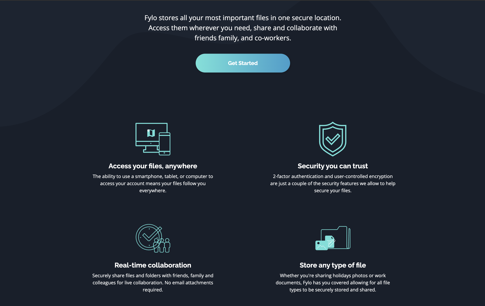
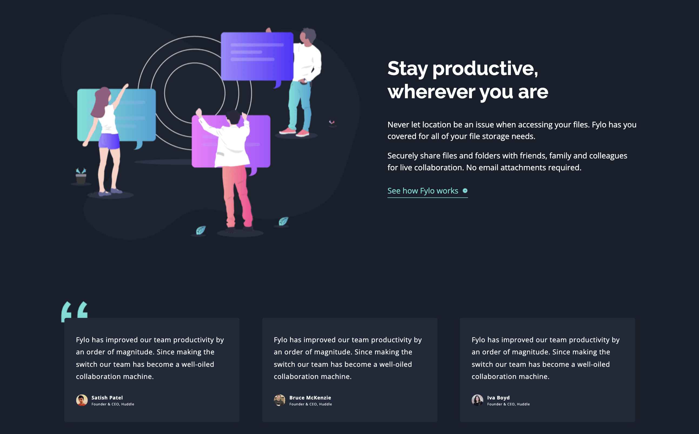
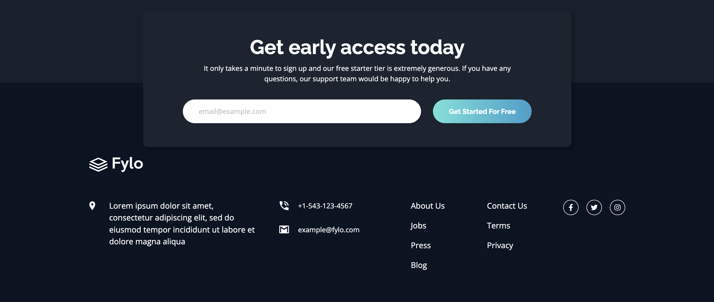

# Fylo dark theme landing page

## Table of contents

- [Overview](#overview)
  - [Screenshot](#screenshot)
  - [Links](#links)
- [My process](#my-process)
  - [Built with](#built-with)
- [Author](#author)

## Overview

### Screenshot

### Links

- Solution URL: [Solution URL](https://github.com/kisu-seo/fylo_dark_theme_landing_page)
- Live Site URL: [Live URL](https://kisu-seo.github.io/fylo_dark_theme_landing_page/)

## My process

### Built with

- **Semantic HTML5 Markup** - Utilizing `<header>`, `<main>`, `<section>`, and `<footer>` for an accessible and meaningful document structure.
- **CSS Custom Properties (Variables)** - Centralizing design tokens in `:root` for colors, typography, and spacing to ensure scalability.
- **BEM Methodology** - Implementing the Block-Element-Modifier convention for an intuitive and maintainable class architecture (e.g., `.header__nav-list`, `.testimonial-card__author`).
- **CSS Grid Layout** - Leveraging powerful 2D layouts for desktop environments, such as the multi-column Features section and the complex 5-column footer layout.
- **Flexbox Layout** - Managing 1D vertical alignments for mobile views and implementing precise alignments (justify-content, align-items) across various components like the navigation and form inputs.
- **Mobile-First Workflow** - Establishing Base Styles for mobile viewports and utilizing Progressive Enhancement through Tablet (768px) and Desktop (1024px) breakpoints.
- **Google Fonts** - Integrating 'Open Sans' for body text and 'Raleway' for headings consistently across the design.
- **Vanilla JavaScript** - Implementing client-side form validation for the email subscription input without relying on external libraries.
- **Accessibility (a11y)** - Adding `aria-label` attributes to icon links and visually hidden elements, and using `aria-hidden="true"` for decorative images to support screen readers.
- **Desktop-only Hover States** - Restricting hover interactions within `@media (min-width: 1024px)` to prevent the 'sticky hover' bug on touch-based devices.
- **Advanced CSS Techniques** - Utilizing negative margins for overlapping sections (e.g., early access form and footer) and `display: contents` for complex grid structure management.

## Author

- Website - [Kisu Seo](https://github.com/kisu-seo)
- Frontend Mentor - [@kisu-seo](https://www.frontendmentor.io/profile/kisu-seo)
